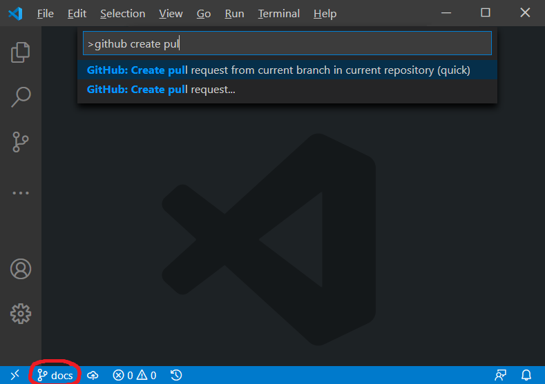
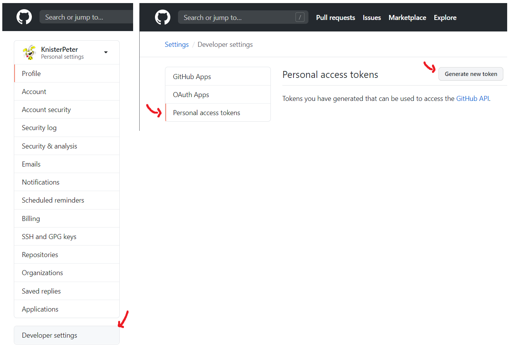
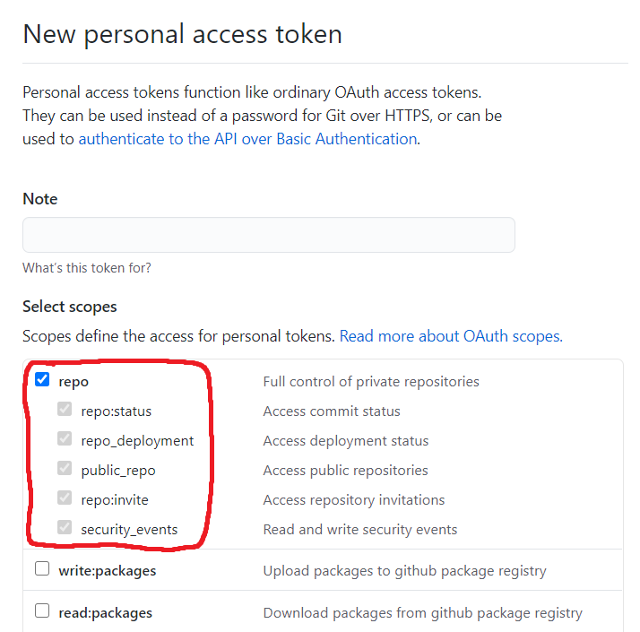
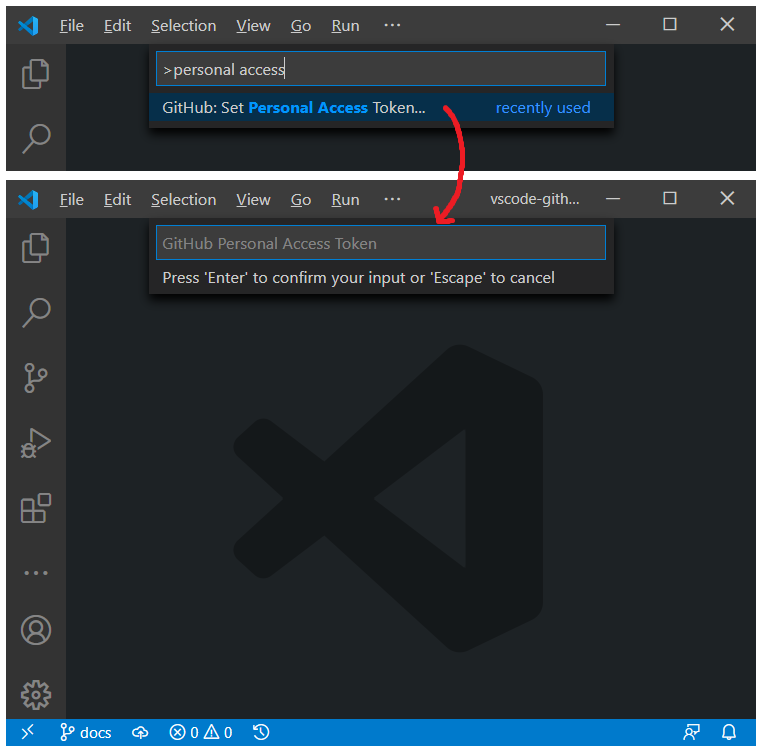

# vscode-github README

This vscode extension integrates with GitHub.

**Note: I recommend to use [GitHub Pull Requests](https://marketplace.visualstudio.com/items?itemName=GitHub.vscode-pull-request-github) instead of this, because most usecases are supported and there is a team at Microsoft/GitHub supporting development**

## Features

Currently it is possible to do the following:

- Checkout one of the open pull requests
- Open github page for the current project in your default browser
- Browse one of the open pull requests in your default browser
- Browse the pull requests of your current branch
- Display pull request and current status (e.g. mergeable, travis build done, ...) in the StatusBar (if enabled)
- Create a new pull request based on the current branch and the last commit
  The current branch will be requested to merge into master and the pull request title is the commit message summary, or a custom message if configured that way.
- Create a pull request in forked repositories
- Allow to select a branch to create a pull request for
- Merge current pull request with either of 'merge', 'squash' or 'rebase' method.
- Configure default branch, merge method and refresh interval.
- Allow to manage assignees for pull requests
  - Assign or unassign a user (currently only one)
- Allow to create and cancel pull request reviews
- Support for GitHub Enterprise (on-premise installations)
- Browse open issues
- Browse the current open file (including current cursor position)
- Configure the statusbar behaviour by setting the `github.statusBarCommand` configuration value.
- Specify a GitLab private access token and connect to a GitLab server
- Support multi folder setup

## Setup Personal Access Token

To use this extension one needs to create a new GitHub Personal Access Token and registers it in the extension.
The 'GitHub: Set Personal Access Token' should be executed for that.
To execute the 'GitHub: Set Personal Access Token' type Ctrl+Shift+p in VSCode to open the command palette and type 'GitHub: Set Personal Access Token'. You will then be prompted to enter the token generated from GitHub.

Additionally, by default this extension assumes your remote for a checked out repo is named "origin". If
you wish to use a remote with a different name, you can control this by the `github.remoteName` setting.

There are additional settings for this extension as well, enter `github.` in the User Settings pane of
VS Code to see them all.

## Usage

### Create a new pull request

1. Create a new local branch from the commit you wanted to start developing with
1. Do you code changes
1. Commit your changes
1. Push your changes to your remote
1. Then execute `Create pull request from current branch in current repository (quick)`
1. In the status bar you can then see the status of your created pull request and if you'd like to open it

### Create a new pull request from a forked repository

1. Fork a repository and clone it afterwards
1. Create a new local branch from the commit you wanted to start developing with
1. Do you code changes
1. Commit your changes
1. Push your changes to your remote
1. Then execute `Create pull request...`
1. Select the upstream repository you want to create the pull requests for
   **Note**: The status bar will not reflect the pull request status in this case

### Checkout pull request

1. Execute `Checkout open pull request...`
1. Select a pull request from the list
1. The pull request is checked out and your working copy switches to that branch

### Browser pull request

1. Execute `Browse open pull request...`
1. Select a pull request from the list
1. Your default browser opens the pull request on github

### Merge pull request

1. Execute `Merge pull request (current branch)...`
1. Select your merge strategy from the shown list (merge, squash, rebase)
1. The pull request associated with your current branch is then merged

### Telemetry data (extension usage)

This extension collects telemetry data to track and improve usage.
The collection of data could be disabled as described here <https://code.visualstudio.com/docs/supporting/faq#_how-to-disable-telemetry-reporting>.

## Contributors ✨

Thanks goes to these wonderful people ([emoji key](https://allcontributors.org/docs/en/emoji-key)):

<!-- ALL-CONTRIBUTORS-LIST:START - Do not remove or modify this section -->
<!-- prettier-ignore-start -->
<!-- markdownlint-disable -->
<table>
  <tr>
    <td align="center"><a href="https://about.me/knisterpeter"> <b>Markus Wolf</b></a> <a href="https://github.com/KnisterPeter/vscode-github/commits?author=KnisterPeter" title="Code">💻</a></td>
    <td align="center"><a href="https://valler.dev/"> <b>Ross Valler</b></a> <a href="https://github.com/KnisterPeter/vscode-github/commits?author=RossValler" title="Code">💻</a></td>
    <td align="center"><a href="https://github.com/jeveleth"> <b>Josh Eveleth</b></a> <a href="https://github.com/KnisterPeter/vscode-github/commits?author=jeveleth" title="Code">💻</a></td>
  </tr>
</table>

<!-- markdownlint-restore -->
<!-- prettier-ignore-end -->

<!-- ALL-CONTRIBUTORS-LIST:END -->

This project follows the [all-contributors](https://github.com/all-contributors/all-contributors) specification. Contributions of any kind welcome!
