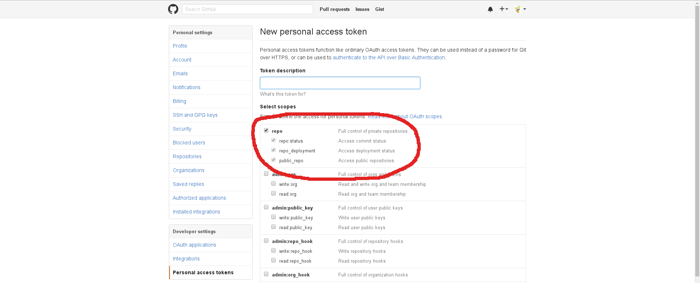

# vscode-github README

This vscode extension integrates with GitHub.

## Features

Current it is possible to do the following:

* Store your GitHub Personal Access Token

To use this extension one needs to create a new GitHub Personal Access Token and registers it in the extension.
The 'GitHub: Set Personal Access Token' should be executed for that.

* Create a new pull request based on the current branch and the last commit  
  The current branch will be requested to merge into master and the pull request title is the commit message summary.

* Checkout one of the open pull requests
