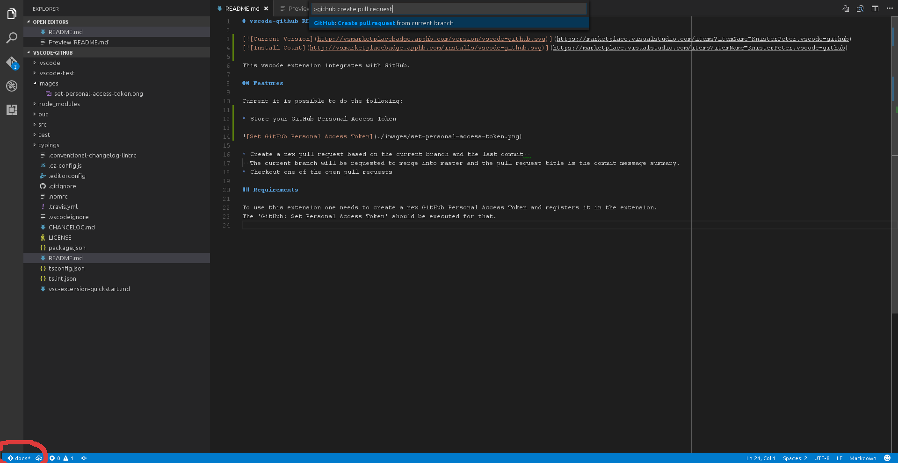
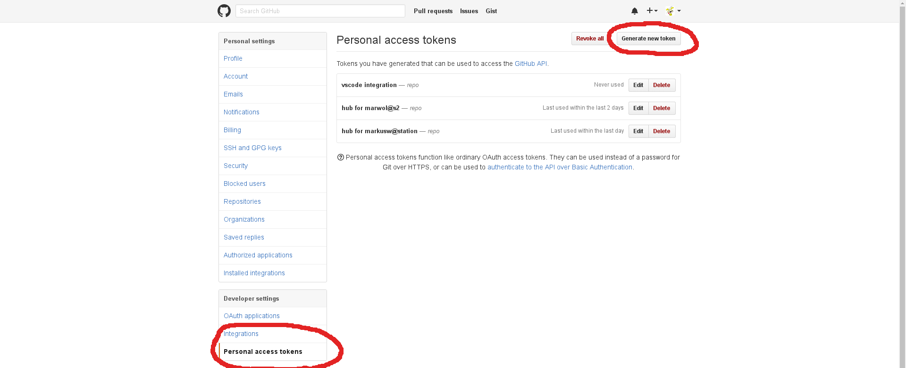
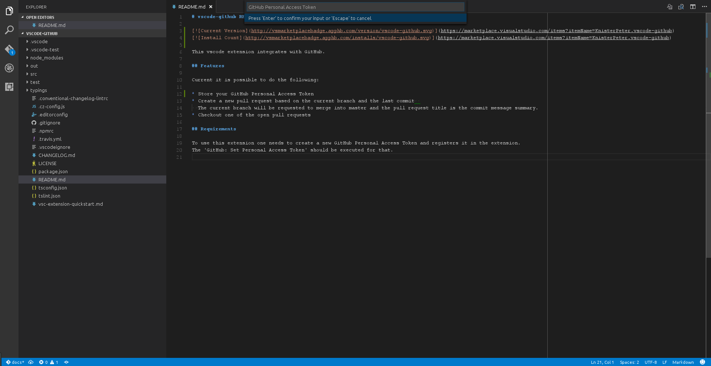

# vscode-github README

This vscode extension integrates with GitHub.

## Features

Current it is possible to do the following:

* Checkout one of the open pull requests
* Browse one of the open pull requests in your default browser
* Display pull request and current status (e.g. mergeable, travis build done, ...) in the StatusBar
* Create a new pull request based on the current branch and the last commit
  The current branch will be requested to merge into master and the pull request title is the commit message summary, or a custom message if configured that way.
* Create a pull request in forked repositories
* Merge current pull request with either of 'merge', 'squash' or 'rebase' method.
* Configure default branch, merge method and refresh interval.

## Setup Personal Access Token

To use this extension one needs to create a new GitHub Personal Access Token and registers it in the extension.
The 'GitHub: Set Personal Access Token' should be executed for that.

## Usage

### Create a new pull request

1. Create a new local branch from the commit you wanted to start developing with
1. Do you code changes
1. Commit your changes
1. Push your changes to your remote
1. Then execute `Create pull request from current branch in current repository (quick)`
1. In the status bar you can then see the status of your created pull request and if you'd like to open it

### Create a new pull request from a forked repository

1. Fork a repository and clone it afterwards
1. Create a new local branch from the commit you wanted to start developing with
1. Do you code changes
1. Commit your changes
1. Push your changes to your remote
1. Then execute `Create pull request...`
1. Select the upstream repository you want to create the pull requets for  
   **Note**: The status bar will not reflect the pull request status in this case

### Checkout pull request

1. Execute `Checkout open pull request...`
1. Select a pull request from the list
1. The pull request is checked out and your working copy switches to that branch

### Browser pull request

1. Execute `Browse open pull request...`
1. Select a pull request from the list
1. Your default browser opens the pull request on github

### Merge pull request

1. Execute `Merge pull request (current branch)...`
1. Select your merge strategy from the shown list (merge, squash, rebase)
1. The pull request associated with your current branch is then merged
